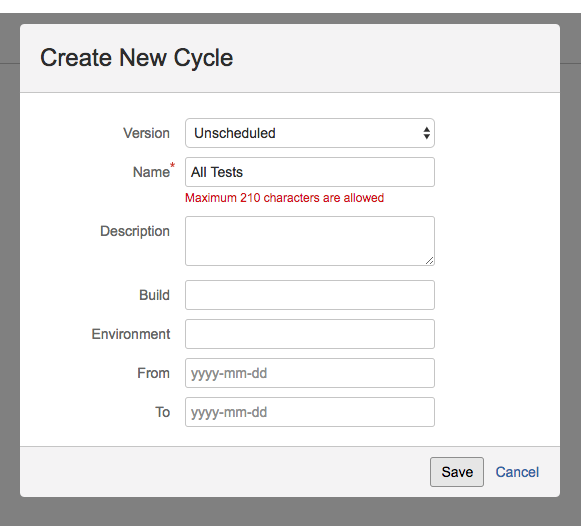
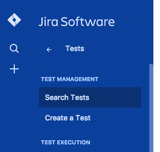
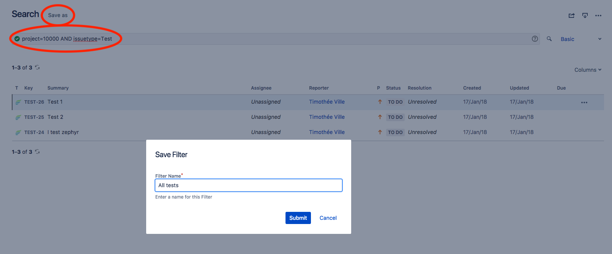
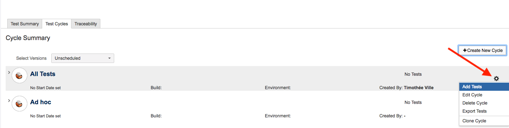
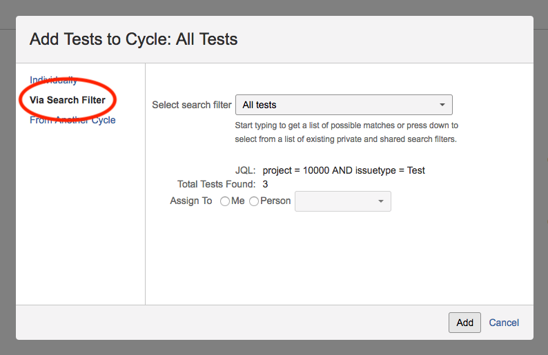
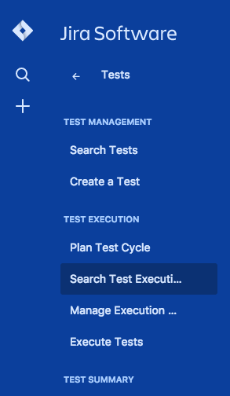
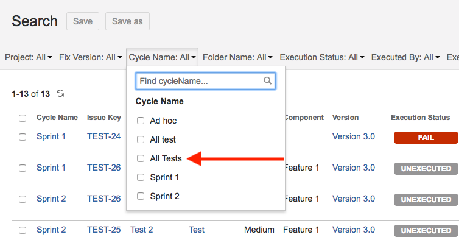
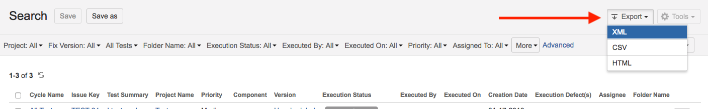
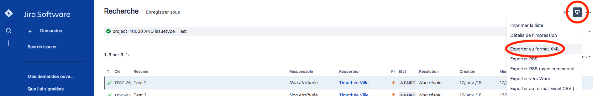

# Zephyr project migration

[](https://app.shippable.com/github/hiptest/migrate)

## 1. Export Zephyr project.

The only way to retrieve the steps of each test case is to put all of them in a test cycle and to export that test cycle.
You can do it (bulk) by following these steps :

 1. Create a dedicated test cycle (called "All Tests" for example).

 

 2. In the 'Search Test' section, create a search filter ('save as' button at the top of the page) named 'All tests' that only filter the issueType to 'Test':
 project=<projectId> AND issuetype=Test

 

 

 3. Press the 'All Tests' gear in the test cycle list, select "add tests", then enter the filter name 'All tests' in the 'search filter' pane. Validate.

 

 

 4. All your tests are now imported to the 'All Tests' test cycle. You should now be able to export the 'All Tests' test cycle from the 'Search test execution' page.

 

 

 

Finally, to have all test informations (like description, etc), could you please try to export all zephyr tests from the 'Search Test' page:




## 2. Execute script
### 2.1 => Prepare authentication

Migration script needs some variable to push exported project to Hiptest:

 1. HT_ACCESS_TOKEN, HT_CLIENT, HT_UID: can be found in your Hiptest profile page. Once you have them, export them in your shell session

 2. Now you will have to create a project from Hiptest application then retrieve your project id in the URL : "https://hiptest.net/app/projects/YOUR_PROJECT_ID/" and export it in the HT_PROJECT variable in your shell session.

We suggest you to put them in a shell script (here named config.sh) like this
```shell
# config.sh
export HT_ACCESS_TOKEN=<YOUR_ACCESS_TOKEN>
export HT_CLIENT=<YOUR_CLIENT_ID>
export HT_UID=<YOUR_PROFILE_UID>

export HT_PROJECT=<YOUR_PROJECT_ID>
```
And export them all every time you need with `source config.sh`

### 2.2 => Import data

Once every session variables are set, you could launch the script with:
```shell
ruby migrate.rb --info=<INFOS_FILE_PATH> --execution=<EXECUTIONS_FILE_PATH> --only import
```
It will migrate all your scenarios in Hiptest.

### 2.3 => Push results

Now your project is entirely and successfully imported in Hiptest, you can push your execution cycle results with the command:
```shell
ruby migrate.rb --execution=<EXECUTIONS_FILE_PATH> --only push_results
```
PS : *You need to push results for every execution cycle exports you have*

## Notes
The `--only` option is optional, if it is not specified, the script will import then push results.

For more informations, please launch `ruby migrate.rb --help`
